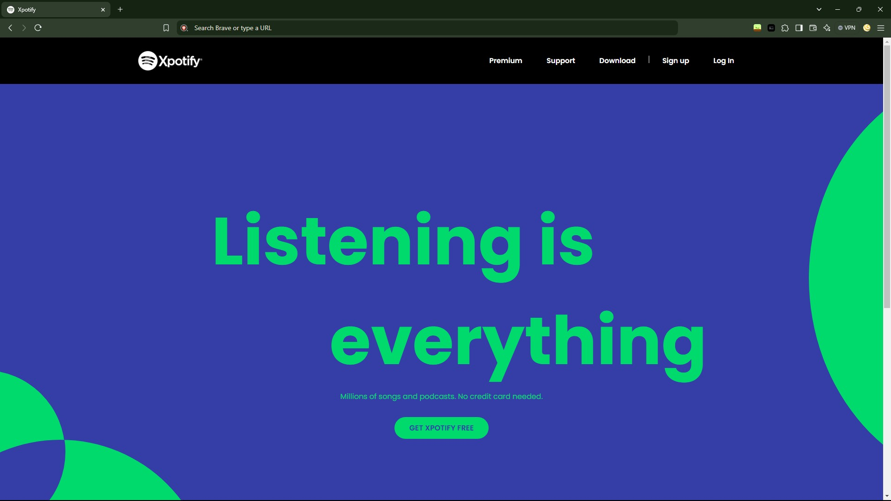
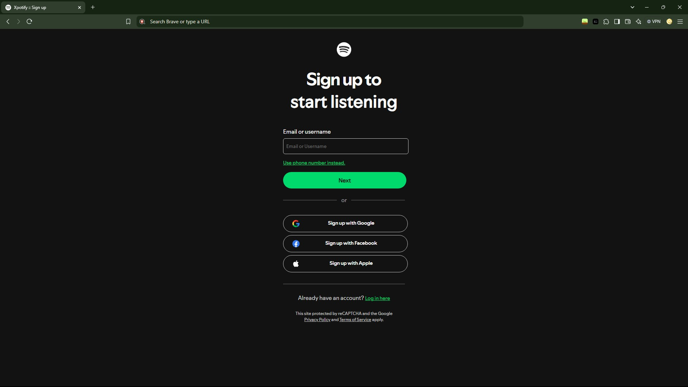
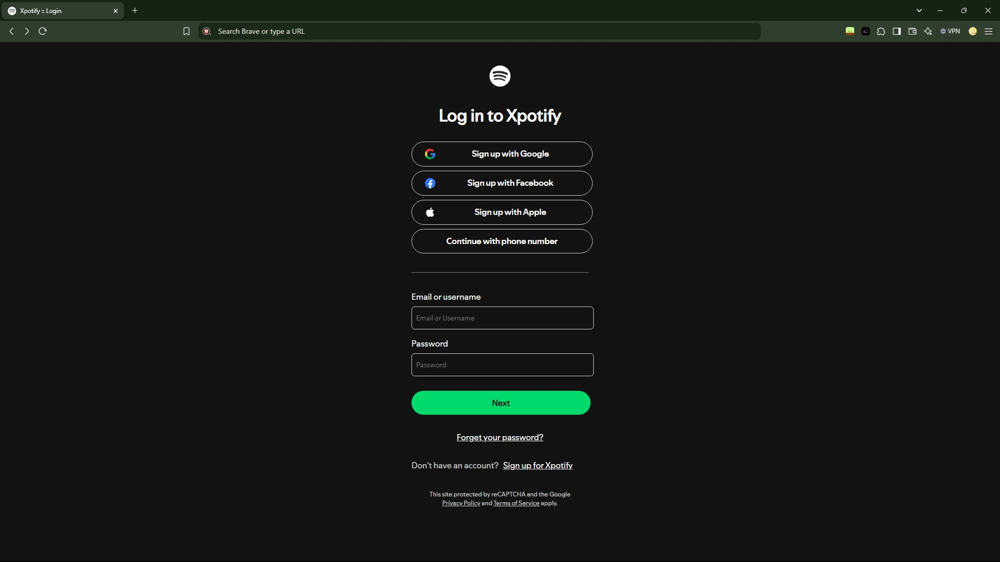
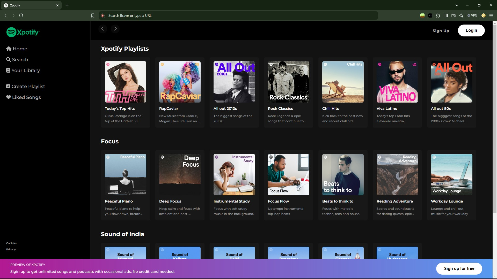

# Xpotify

This is a fresh take on Spotify, in four parts, a landing page, a login & sign-up page, and finally, the main website, in HTML, CSS & a little bit of FontAwsome.

The assets can be found: [here](https://github.com/prodev2004/spotifyHomePageClone), [here](https://github.com/Tarun-Githubs/spotify-clone) and [here](https://drive.google.com/drive/folders/1QoqvFboNmviGdr2qPrqR44tgq-qt192c).

**(Thanks ALB Dev, Tarun Code & constGenius!)**


## Acknowledgements

 - Tutorial(s) by: [ALB Dev](https://www.youtube.com/@ALBDev), [Tarun Code - Web Designer](https://www.youtube.com/@taruncode_) & [constGenius](https://www.youtube.com/@constGenius).

 - A huge shoutout to my youngest project as of writing this: [Xinder](https://github.com/l-xdt/xinder).

 - A huge help in this project, and most of my projects: [DiffChecker](https://diffchecker.com/).


## Authors

- [The LeidenSchaft-Xiotim Development Team](https://www.github.com/l-xdt/)

- [Alvin Maranx, II ツ (Avun)](https://www.github.com/avunii/)

- [ALB Dev](https://www.youtube.com/@ALBDev)

- [Tarun Code - Web Designer](https://www.youtube.com/@taruncode_)

- [constGenius](https://www.youtube.com/@constGenius)


## Demo

There is a demo on this project! and I'm not being indirect, here is the link: click [here](https://l-xdt.github.io/xpotify/).


## Features

- Can be used offline because it uses FontAwsome for 3 icons.

- Mostly reliant on images, also good for offline.

- You are in control of the project.

- There are many factors to change: like the color palette.

- **PS:** There is a lot of little features, I haven't gone over, so that one I will leave to the user.


## Screenshots









**Written in plain HTML & CSS, and uses a little bit of FontAwsome, and some other features.**


## Run Locally

Clone the project

```bash
  git clone https://github.com/l-xdt/xpotify/
```

Go to the project directory

```bash
  cd xpotify
```

Install XAMPPP (via Chocalatey, if you don't have it).

```bash
  chocalatey install xampp
```

Start the server

```bash
  [Directory]/[ServerName]/apache-start.bat
```

**PS:** If you trust your web skills, here is a manual on how to self-host a domain, [here](https://www.youtube.com/watch?v=_eQGAJVtRCs) (by Soeng Souy)


## Roadmap

- Change the Images.

- Change the color pallette.

- Change the icons.

- Change the HTML.

- Change the CSSS.

- Change whatever you would like to make it your own.

- Change the code.

- Inspired by our signature: **X**, which you can change if you wanted.

- **PS:** You can get from the landing screen by just pressing 'Get Xpotify Free', if you don't want to pres the other options.


## Support

For support, shoot a message to either of our emails: [here](mailto:leidenschaft.tech@hotmail.com) or [here](mailto:trowesigames@gmail.com) or join our Discord Server: which is not up as of writing this.

## Feedback

This applies to feedback aswell, Whether you want to give us positive words of encouragement, or negative words, send away! (but please, only send constructive critisism).

Send away: [here](mailto:leidenschaft.tech@hotmail.com) or [here](mailto:trowesigames@gmail.com).


## FAQ

**Now, for one last time, my fav! FAQ!**

#### Can I modify this to fit my needs?

Yes! Why of-course! That is why make stuff like this and publish it onto the internet, for you to try, fail, learn from your mistakes, using our code as a place of refrence.

#### Can I host this, If I can, how?

Yes you can! With my favourite Apache Container, XAMPP! Since I have explained it 23, times (now, you can see that if you look at our reopositories). So I will skip that part because you know the drill.

So! Here is a [download](https://www.apachefriends.org/download.html) to the server, XAMPP! (of-course)! And if you are struggling about you can start by hosting with this [tutorial](https://www.youtube.com/watch?v=LzucEZh4_no) (by MainlyWebStuff).

And if you truly trust your web skills, you can use this [tutorial](https://www.youtube.com/watch?v=_eQGAJVtRCs) (by Soeng Souy), to self-host a domain.


## Used By

This project is used by the following companies:

- Leidenschaft-Xiotim Accquisitions (Limited).

- XDT-Studium.

- Xiotim Development Team [Limited] (XDT).

- XDT-noHesi.

## Related

Here are some related projects:

- [Xpotify -This Project](https://github.com/l-xdt/xpotify/)

- [Xinder](https://github.com/l-xdt/xinder/)

- [xFlix](https://github.com/l-xdt/xflix/)

- [LinkedX](https://github.com/l-xdt/linkedx/)

- [Main Website](https://github.com/l-xdt/l-xdt.github.io/)

- [FTP (x-FTP)](https://github.com/l-xdt/ftp/)

- [L-XDT](https://github.com/l-xdt/l-xdt/)

- [Documentation (x-Doc)](https://github.com/l-xdt/documentation/)

- [Phone (xPhone-UI)](https://github.com/l-xdt/phone/)

- [xLinks](https://github.com/l-xdt/xlinks/)

- [XInterest](https://github.com/l-xdt/xinterest/)

- [Xelegram](https://github.com/l-xdt/xelegram/)

- [XApp](https://github.com/l-xdt/xapp/)

- [XCord](https://github.com/l-xdt/xcord/)

- [XChat](https://github.com/l-xdt/xchat/)

- [XGram](https://github.com/l-xdt/xgram/)

- [xSocial](https://github.com/l-xdt/xSocial/)

- [Xirox](https://github.com/l-xdt/xirox/)

- [XioTube](https://github.com/l-xdt/xiotube/)

- [Studium](https://github.com/l-xdt/studium/)

- [XioTok](https://github.com/l-xdt/xiotok/)

- [XioTim](https://github.com/l-xdt/xiotim/)

- [noHesi](https://github.com/l-xdt/no-hesi/)

## Documentation
- I don't have any proper documentation, but I can give you the links to the tutorial(s):

- ALB Dev's Tutorial (in two parts): [Part One](https://www.youtube.com/watch?v=Ku66X6NuRPE) and [Part Two](https://www.youtube.com/watch?v=WkqikQwZsRA) on YouTube

- [Tarun Code's Tutorial (on YouTube)](https://www.youtube.com/watch?v=TF9xmKl7X8A)

- Oh, and last but not least: [constGenius' Tutorial (on YouTube)](https://www.youtube.com/watch?v=TdjmTjuU8JE)


## API Reference

There are no APIs, to be known of, used in this project. This project only consists of Vanilla HTML, CSS and slight traces of FontAwsome. If there are any APIs used I will update this readMe.


